# WEARABLES
<p>Welcome to WEARABLES e-commerce website! in this website you can browse, search, filter and checkout a variety of tech wearables products.
This app was created in one week, as a group project in Full-Stack Web Development course with <a href='https://concordiabootcamps.ca/' alt='link to Concordia Bootcamps website'>Concordia Bootcamps</a>.</p>

---
## Info
<p>Here is a <a href='https://www.youtube.com/watch?v=JE2BImwryZU'>short video</a> explanation.</p>

<p>Using MongoDB, React, and Node as base, this app provides a real-like experience of online shopping. we tried to make it flow, intuitive and reliable.</p>

---
## Screen Shots
<div display='flex' flexDirection='row'>
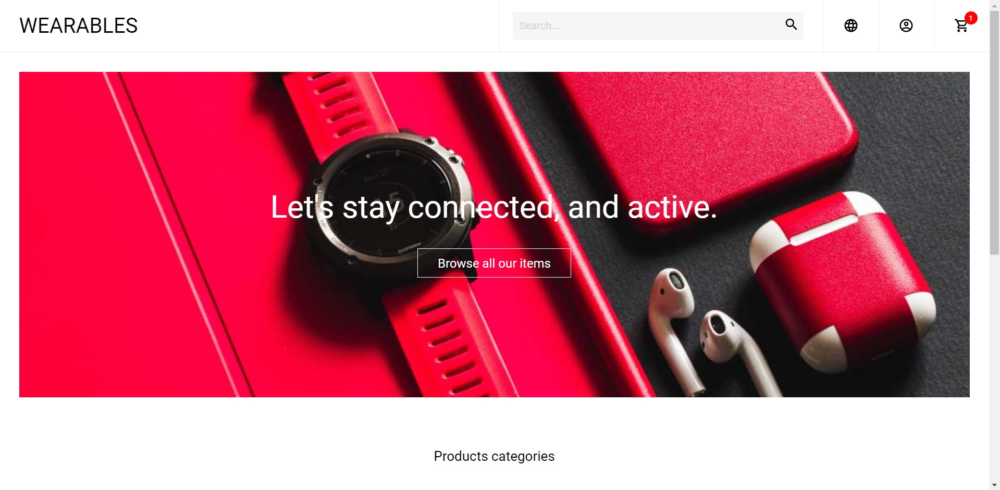
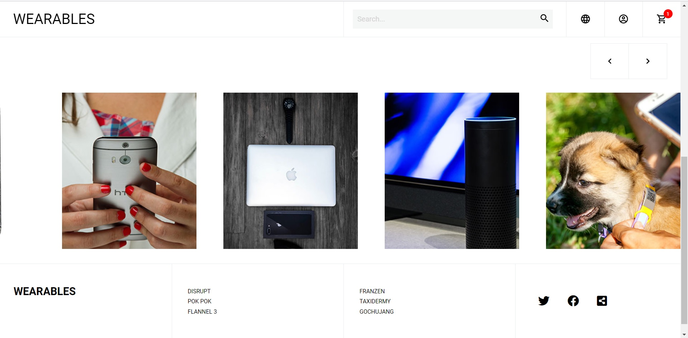
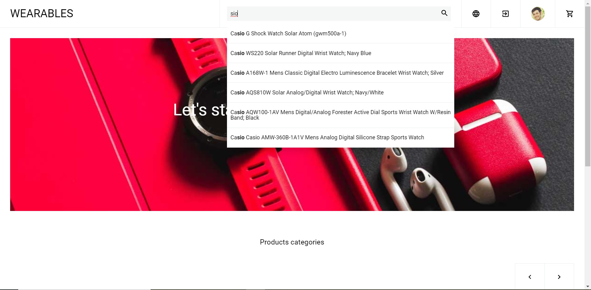
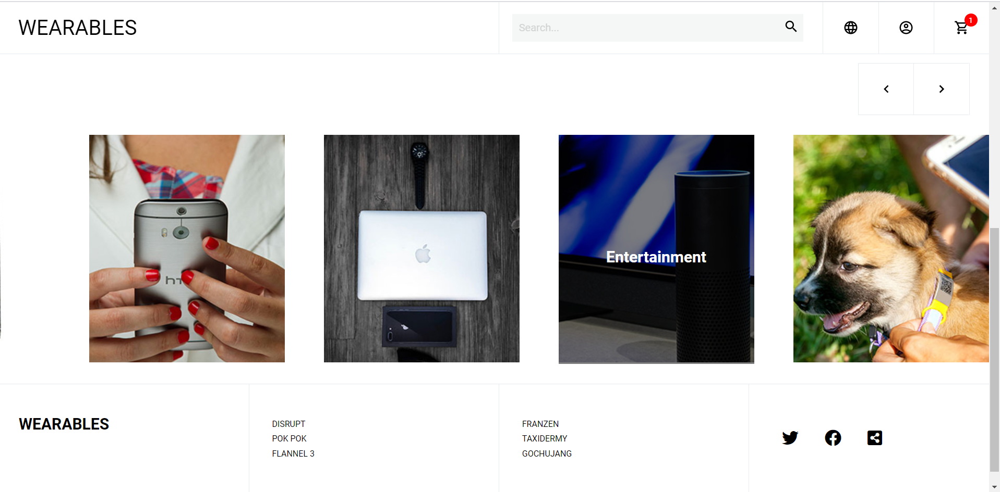
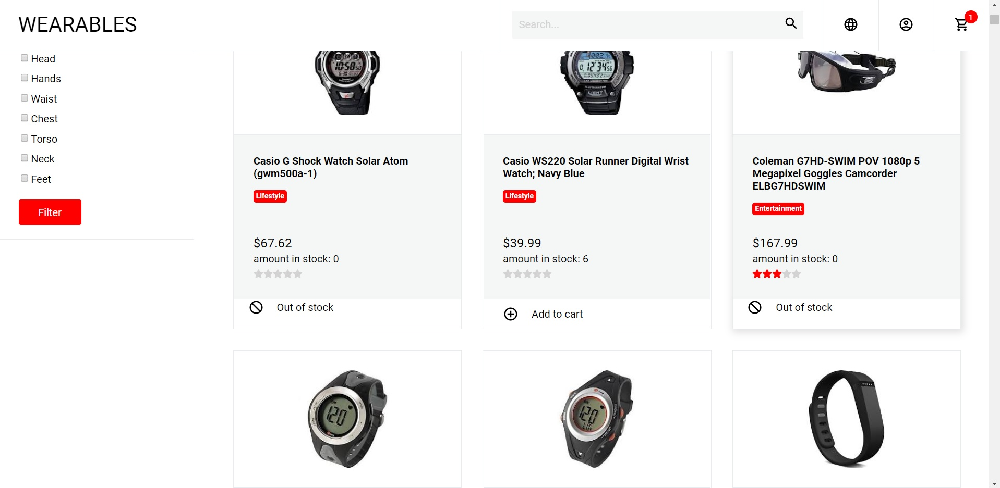
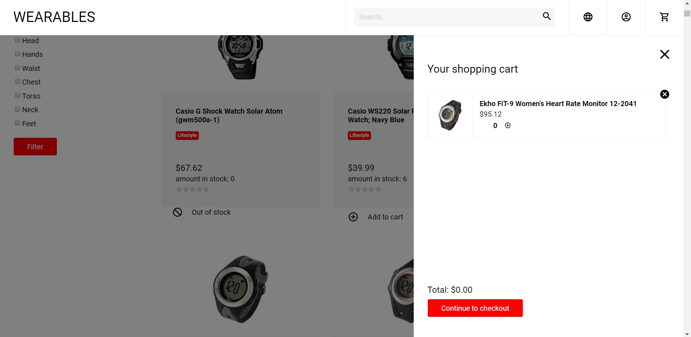
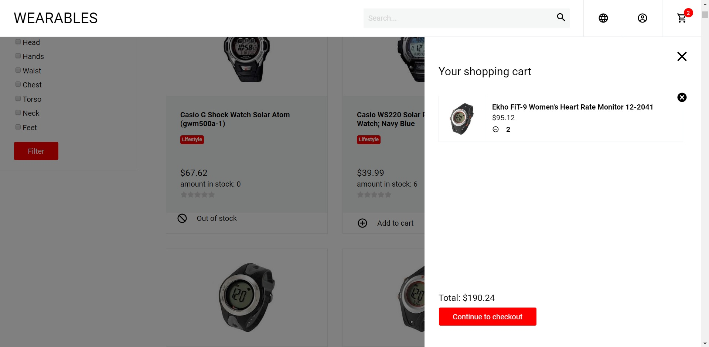
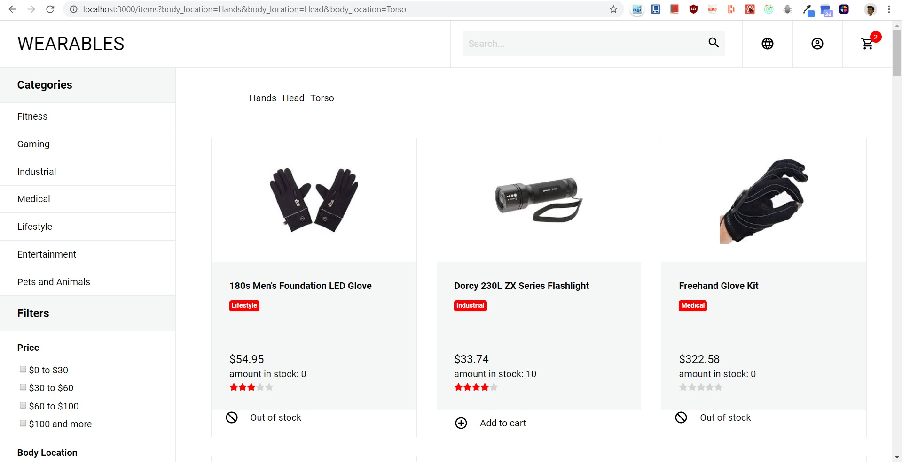
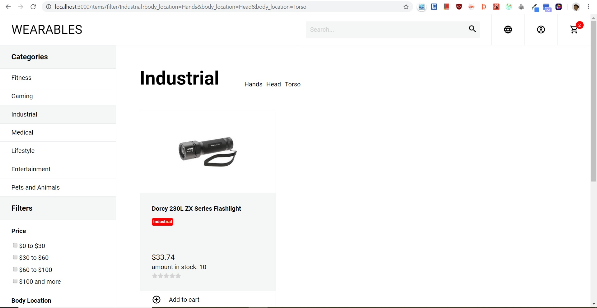
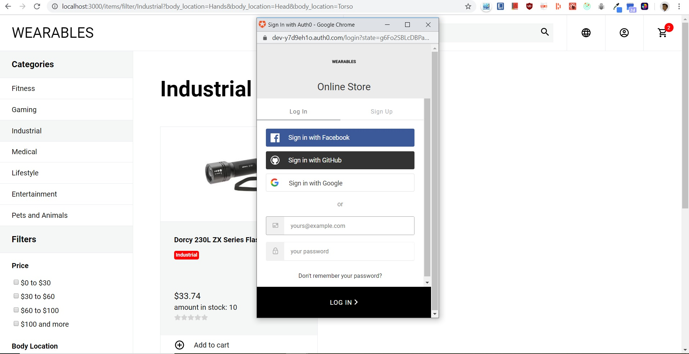
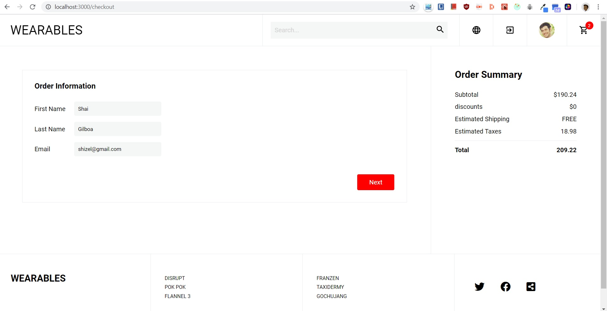
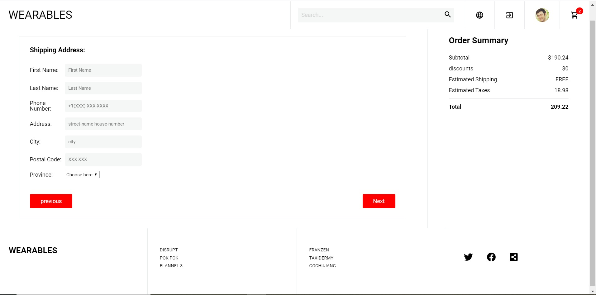
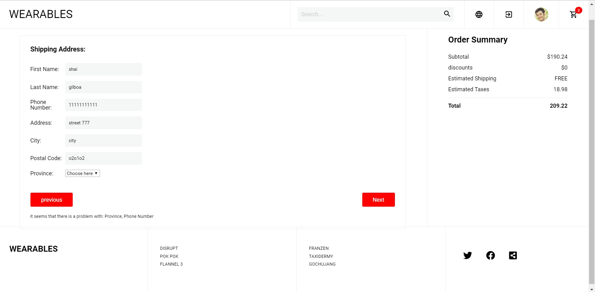
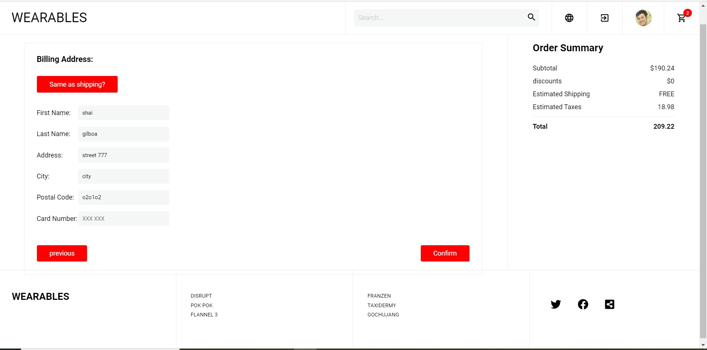
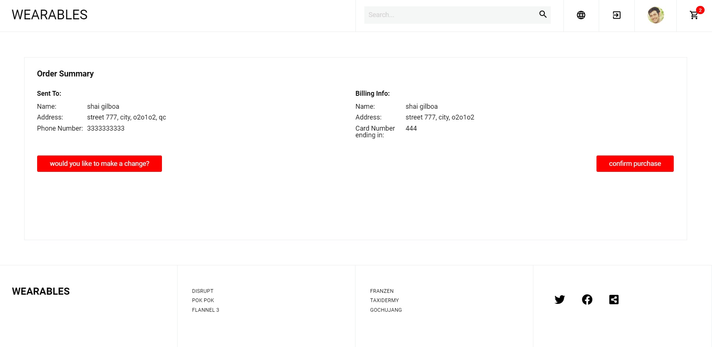
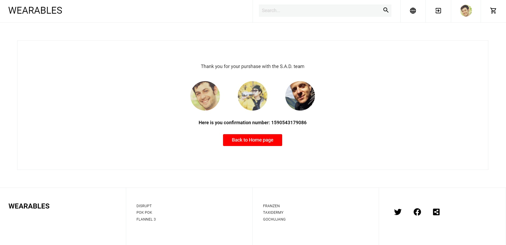
<div>

---
## Installing
1. Clone the repo.
2. In both client and server directory terminals, run commands ```$yarn install``` and  ```$yarn start```.
3. Login using Google Login.

------
## Technologies
Technologies utilized in this project include:
### Front End:
React, Redux, JavaScript, Styled Components 
### Back End:
Express.js, Node, MongoDB

---
## Key points in the process
- This was a group project, and in so, we had a lot of experience working with Git and GitHub.
- Reading, understanding and debugging team member's code.
- We were given the JSON files that would become our database, and had to make to most of them.

### potential additions 
Starting this project we had (like many before us) many unrealistic goals. for now, these will be my future stretch goals.
 - Update user profile: image, name, preferred color, purchase history.
 - admin access that allows to change the products, and quantities.
 - "people that have bought this, also bought that" feature.
 - reviews.

---
## Contact

If you want to contact me you can reach me at <shizel@gmail.com>.